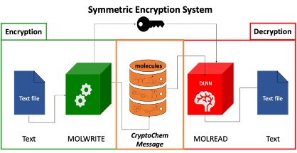

# CryptoChem

This is the offical implementation of CryptoChem: Transferring Information in Virtual Chemical Molecules.

**Cryptochem** is a novel cheminformatics encryption technology that can securely store and transfer information using chemicals. Coupled with machine learning approaches, Cryptochem offers a highly complex and robust system with multiple layers of security for transmitting confidential information. Cryptochem directly uses chemical structures and their properties as the central element for securely storing information and employs intricate QSDR (Quantitative Structure-Data Relationship) models as keys to retrieve the stored data. 

**CryptoChem** consists of `Molwrite` and `Molread`, enabling the encoding and retrieval of information using series of molecular structures. `Molwrite` program stores and encodes a given message in the molecular format (CryptoChem message) and the `Molread` program decodes a given CryptoChem message using the right QSDR model. 

## Usage
1. Download this repository.
2. Check `CryptoChem User Manual for Windows.pdf` for usage.